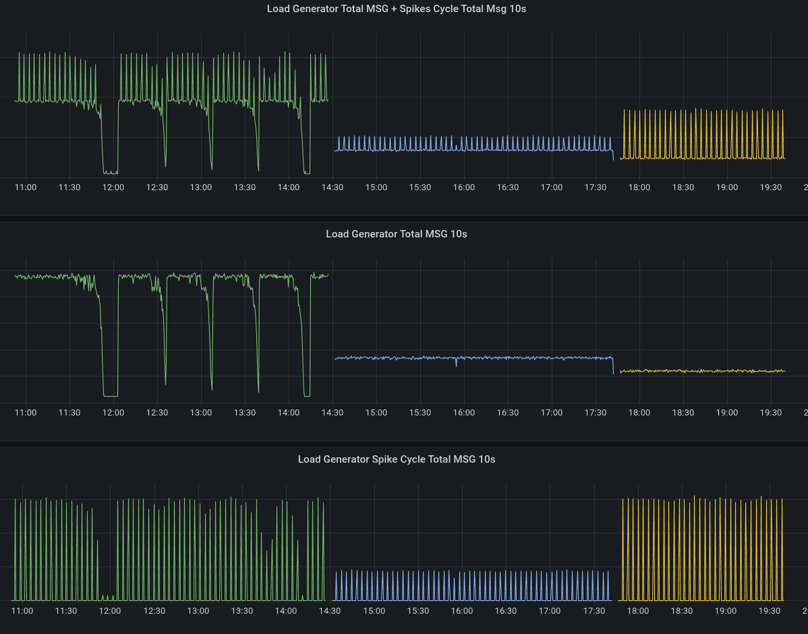

# ETSAD - Enhanced Time Series based Anomaly Detection in Load Test Results
This repository is the ETSAD paper experiments verification repository

*Note: The paper is not yet published, however it is pending review for being accepted for publication. As soon as that process completes, publication details shall be added here.*

In order to execute the below guide, access to a Red Hat OpenShift environment is required. If you don't have one, you can start a trial by creating an account at [RedHat Cloud website](https://cloud.redhat.com). Alternatively, it is also possible to execute the guide on a local (reduced version) of the platform, typically used for development purposes. Once you registered on the [RedHat Cloud website](https://cloud.redhat.com), you can obtain your version of the local Red Hat Openshift by downloading the installer from the [Console](https://console.redhat.com/openshift/create/local).

## Foreword
This repository contains the following:
* A quick guide for how to configure a Red Hat Openshift deployment to:
  * Set up an environment for creating and collecting data required by the ETSAD experiments
  * Set up an environment to execute the Machine Learning experiments (training and verfication)
* ETSAD research question related information:
  * Example data used as input to train and verify the ML models
  * The ML models used to test the research questions
  * The summary of the results for the three research questions

## What is Red Hat OpenShift

[Red Hat OpenShift Container Platform](https://www.redhat.com/en/technologies/cloud-computing/openshift/container-platform) (RHOCP) is a leading enterprise Kubernetes platform that enables a cloud-like experience everywhere it's deployed. Whether it’s in the cloud, on-premise or at the edge, Red Hat OpenShift gives you the ability to choose where you build, deploy, and run applications through a consistent experience (Source: [RedHat](https://www.redhat.com/en/technologies/cloud-computing/openshift)).

In other words, Red Hat OpenShift Container Platform is a private Platform as a Service (PaaS) for enterprises that run OpenShift on public clouds or on-premises infrastructure. The OpenShift platform is a consistent hybrid cloud foundation for building and scaling containerized applications. In other words, it is an open-source container orchestration platform for enterprises. It includes several container technologies, primarily the OpenShift container orchestration software, which is based on the OKD open-source project. Red Hat OpenShift combines Kubernetes components with security features and productivity necessary for large enterprises and is especially useful in hybrid cloud scenarios.

Red Hat OpenShift uses operators. [Operators](https://docs.openshift.com/container-platform/4.11/operators/understanding/olm-what-operators-are.html) are pieces of software that ease the operational complexity of running another piece of software.

Throughout this guide we shall use several operators for different purposes.
* Red Hat OpenShift Data Foundation - we shall only use the Multicloud Gateway deployment option as we only need S3 compatible object bucket store
* Red Hat OpenShift AI -(RHOAI) to run the ML experiments.
* KubeRay - supporting operator for RHOAI for running parallelized ML distributed experiments (alternative to CodeFlare operator).
* MLFlow - for storing the ML experiment results.
* CrunchyDB PostgreSQL operator - support for MLFlow (required to store experiment metadata information and other MLFlow related metadata).
* Tekton -  for running automated pipeline workloads (in our case for syntetic data generation for the ML experiments).
* Prometheus - for collecting metrics required for ML experiments.
* Grafana - for visualizing metrics. This operator is optional since data visualization may be created also inside RHOAI using various Python libraries.

More details about the operators shall be provided as needed in the next sections.

*Note: This guide assumes RHOCP version 4.13.X is used.*

## Red Hat OpenShift setup and configuration for ETSAD experiments
The RHOCP platform comes with a default user with administrative privileges, kubeadmin. This user is not intended to be used on a day to daybasis and is in general used for initial setup and recovery. The kubeadmin password is generated by the installer at the end of the installation process. Use this password to login to the platform and add an OAuth provider with some users. The simplest way to do this is to setup `htpasswd` provider. 

Before setting up the authentication method we need to create a list of users and encoded passwords in htpasswd file. Below is an example how to do this using the htpasswd command:
```bash
htpasswd -c -B -b users.htpasswd "user1" "user1-@rhlab"
htpasswd -B -b users.htpasswd "clusteradmin" "admin123-@rhlab"
```

Then, using the RHOCP web console, logged in with kubeadmin, initiate the OAuth setup and select htpasswd and provide the file generated with the above commands.

As soon as users have been added, at least one should be promoted to be a cluster admin. Assuming that one user was created with the name `clusteradmin` as highlighted above, the following list of commands promote that user to an admin role:
```bash
oc adm groups new mylocaladmins
oc adm groups add-users mylocaladmins clusteradmin
oc adm policy add-cluster-role-to-group cluster-admin mylocaladmins
```

Log out from the web console and cli and log back in with the newly created `clusteradmin` user. Now we are ready to go to the next phase where we add the requried operators that will help in setting up the environment for the `ETSAD` experiments.

Depending on their purpose and use, the operators shall be deployed either globally or within a specific namespace, called `demo`. This `demo` namespace is the dedicated location where the synthetic data generation takes place. 

To start with the setup we shall install one by one the global operators:
* Install Red Hat OpenShift Pipelines operator. This shall provide tekton pipelines inside RHOCP.
* Install Red Hat OpenShift Data Foundation. This operator actually installs inside a dedicated workspace (reserved for it). After the installation we need to create an instance for the operator. Since we are only interested in the object bucket store, we need to select the MultiObject Gateway option when instantiating the operator.
* Install the CrunchyDB PostgreSQL community operator. The PostgreSQL and Data Foundation instance shall be used by the MLFlow instance deployment to store metadata and artifacts information respectively.
* Install the MLFLow operator and instance following the instruction from [here](https://ai-on-openshift.io/tools-and-applications/mlflow/mlflow/#pre-requisites).
* Install Kuberay operator using the following command:
  * ` oc create -k "github.com/ray-project/kuberay/ray-operator/config/default?ref=v0.5.0&timeout=90s"`
  * After the installation create a new namespace for a Ray cluster. If using the command line tool, create it as `oc new-project ray-cluster`
  * A cluster instance configuration is provided in the [kuberay-cluster-example](kuberay-cluster-example) folder. This will create a cluster of 10 workers. At full scale, this cluster requires 20 CPU and 40GB of RAM from the RHOCP cluster. Make sure you have sufficient compute configured in your OCP cluster before creating the cluster from that sample file, or adjust the resource definition accordingly. To create a cluster instance using the provided sample, execute `oc apply -f kuberay-cluster-example/ray-cluster.complete-py39-tf2_11_1-4Gi.yaml `.
* Install Red Hat OpenShift AI (formerly known as Red Hat OpenShift Data Science) operator and create an instance. This operator will create several namespaces. The route to the UI, the RHOAI dashboard, is available under the `redhat-ods-applications` namespace.

Now we are ready to create a new namespace where the synthetic data can be generated. In that namespace we shall add the remaining operators and deploy the Tekton pipeline that will generate data for the `ETSAD` experiments.

## ETSAD Synthetic Data Creation
As mentioned above, we shall create a namespace (OpenShift project) we call `demo` to setup the data generation environment and then execute to generate data. Please ensure you have a local copy of the GitHub repository of this project and the OpenShift command line tool (`oc`) on your computer before continuing with this section.

Projects in OpenShift may be created using the web console, or the cli. If using the cli tool, run the following command to create the project:
```bash
oc new-project demo
```

This will also change the current active project to this namespace.

Once the project has been created, use the OpenShift web console and select that project and deploy Prometheus (community version) and Grafana (community version) operators in that namespace.

Once the operators have been deployed, create an instance for each. Please note that by default Prometheus stores data for only 24 hours. Therefore during the instance creation please make sure that you adjust the data retention configuration to the amount of time you wish to be retained.

After the Prometheus instance is running, we need to add the Service Monitors for our load generator and test subject applications. This can be achieved by applying the respective service monitor definitions store as yaml files in the [synthetic-data-generation](synthetic-data-generation/) folder:
```bash
oc project demo
oc apply -f synthetic-data-generation/wiremock-metrics-service-monitor.yaml
oc apply -f synthetic-data-generation/load-generator-metrics-service-monitor.yaml
```
Having these in place will allow Prometheus to periodicall connect to both the load generator and target test subject applications and collect KPI metrics. More details about these two applications in the next sections.

Next, we can proceed with the setup of the automatic data generation process. This is achieved with the help of Tekton. We shall deploy a series of tasks that make up the pipeline and the pipeline definition itself. Note that one of the tasks is a special one that is used only to kickstart the pipeline and run contained inside the OpenShift platform (this way there is no need to keep an active session between the oc client and the platform itself).

We install the pipeline and its components inside the `demo` project:
```bash
oc project demo 
oc apply -f task-gen-random-int-list.yaml
oc apply -f task-wiremock-cleanup.yaml
oc apply -f task-scale-deployment.yaml
oc apply -f task-generate-random-number.yaml
oc apply -f task-calculate-cthreads-value.yaml
oc apply -f task-wiremock-deploy.yaml
oc apply -f task-load-generator-deploy.yaml
oc apply -f task-lt-summary.yaml
oc apply -f task-launch-loop.yaml
oc apply -f auto-lt-wiremock-metrics.yaml
```

The pipeline execution relies on two additional things to be available in the project namespace:
* a service name for the load generator (required by the service monitor)
* a location where to store the load test aggregated results. We shall use an instance of an InfluxDB time series database for that purpose.

To create the load generator service, apply it using the command line:
```bash
oc apply -f load-generator-service.yaml
```

*Note that test subject service is re-created automatically by the pipeline each time a load test scenario is executed, therefore it is not required to be created in advance (if you have somewhat in-depth knowledge of Kubernetes, you can see the difference in the respective task deployment files).*

To create the Influx DB instance we need to first create a PVC (persistent volume claim) inside the demo project. We need to name this claim as `influxdb`. We can achieve this with the web console using the left navigation, select Storage/PersistenVolumeClaim and clicking on the create button. Fill out the name and storage size (e.g. 1Gb) and ensure you are in the `demo` namespace before finalizing the operation.

Next, we define the secrets file for the access credentials to the InfluxDB instance and the deployment configuration file:
```bash
oc project demo1
oc apply -f influxdb-creds.yaml
oc apply -f influxdb-deployment.yaml
```

Wait for the pod hosting InfluxDB to be created then connect to it and initialize it:
```bash
oc project demo1
oc rsh $(oc get pods | grep influx | awk '{print $1}')
influx
create database loadtesting
exit
exit
```
There are two ```exit``` commands required, the first to exit the InfluxDB application and the second to exit the pod.

We also need to expose an endpoint to this instance so that other applications/tasks may find it:
```bash
oc expose deployment influxdb --port=8086 --target-port=8086 --protocol=TCP --type=ClusterIP
```

To control Tekton components (pipeline and tasks) we shall use the tkn cli tool. The data generation process has been verified with version 0.30.1 of tkn cli. To install it, downloaded it from the its GitHub location provided below, unpack and move it somewhere in your $PATH variable:*

```bash
curl -LO https://github.com/tektoncd/cli/releases/download/v0.30.1/tkn_0.30.1_Linux_x86_64.tar.gz
sudo tar xvzf tkn_0.30.1_Linux_x86_64.tar.gz -C /usr/local/bin/ tkn
```

Now we are ready to generate synthetic data with the help of the `tkn-task-loop-run-sample.sh` script. Adjust the number or executions you want inside the script before launching it.

*Note: the existing launch script uses a default configuration. If you want to generate data under different patterns you need to change the parameters passed onto the load generator and the test subject system, wiremock. The next sections provide details about these applications, hosted in separate repositories, referenced inside the respective sections.*

*Note: For convenience purposes, some example synthetic data has been provided in the [notebooks/data](notebooks/data/) folder. Please note that this data is highly correlated with the machine details, hardware resources available to the OpenShift cluster and the configuration details for the data generation trials where the data generation pipeline has been executed.*

### Load Generator Application Details
We created a custom load generator application that is also capable of exposing metrics about the generated traffic while the load is being executed. These metrics are compatible with Prometheus' metrics collection system.

The load generator is capable of introducing spikes in a controlled manner into an existing load. The spikes can be generated at regular intervals and have fixed lenght, or, be generated at random intervals (betwenn a lower and a maximum length of the repetition interval) and have a fixed or random duration (controlled within a lower and a higher duration limit).

The payload of the load generator is a randomly generated string, that may be of fixed or variable length. If a variable length payload is desired, the user must provide details about the number of different payloads to be generated, their length and order of generation (cyclic or random selection).

The source code and parameter list and description for this repository is available in [here](https://github.com/eartvit/load-generator/).

A sample output collected by Prometheus and displayed in Grafan is depicted in the next diagram:


Here, we can see three different load generation processes recorded with different load generation settings. The information displayed here is reflecting how the test subject responded back to the load generator for the requests that have benn sent. We can see that the first load test has a significant number or problems as the throughput KPI drops to zero several times. For the second load, we only see a very small and brief drop in the throughput, where the third one does not present any anomalies. Noteworthy is the aspect that the above example uses a regularly paced out spike generation sequence.

### WireMock test subject System Details
In order to generalize the synthetic data to model the behavior of a large number of business applications that receive a request, process it and provide a response, we need a generic test subject system. To achieve this, the test subject system needs to be evaluate using a black box approach and be able to emulate the behavior of one, or multiple interconnected components.

A good candidate for this emulation is the popular [WireMock](https://wiremock.org/) engine. While WireMock supplies many features of the black box emulation approach, we need to extend its base functionality to integrate it with Prometheus compatible metrics generation and the request chaining. Request chaining is used to emulate several integrated components that talk to each other based on an initial request. The response generated by WireMock is customized using a global random string payload ResponseTransformer that responds with a sizeable randomly generated payload created using the input request's payload details. To summarize, the test subject application, depending on the provided deployment configuration, may recursively call itself a number of times emulating a multi-component, integrated, business application system.

The source code and parameter list and description for this repository is available in [here](https://github.com/eartvit/wiremock-metrics2).

## Data generation and ML experimentation environment setup
The Red Hat OpenShift AI operator (formerly known Red Hat OpenShift Data Science) packages several AI/ML tools. One of them is Jupyter hub. To access it, we shall use the RHOAI dashboard. Access to it is provided inside the Networking section of the `redhat-ods-applications` namespace. The recommended way to use Jupyter is by instantiating a notebook image inside a RHOAI project. Let's name the new project `etsad`. This will create inside RHOCP the namespace etsad and deploy all the project resources here. To access the Jupyter lab instance create a workbench and associate to it a persistent volume. When deploying the workbench select the recommended Tensorflow based image (should be TF 2.11 with Python 3.9 at the date the experiments have been created, December 2023.) If this notebook is no longer available you can obtain it from quay.io (ToDo: provide the link for it from RHOAI business unit or ODH community.)

Wait for the instance to deploy itself. Once this process has completed, upload the notebooks folder from this project. Since the baseline notebook image does not have all the dependencies, install them using the provided install_dependencies notebook.

Now we are ready to perform the ETSAD modelling and collect the results (please ensure inside the notebooks you have the correct Ray and MLFlow endpoints configured).

*Note: The ETSAD ML models experiments can also be performed outside of the RHOAI environment created for the RHOCP PaaS. We just need a python environment that has Ray version 2.6.3 and MLFlow version 2.9.2 available alongside the libraries required within the provided Jupyter notebooks. The TensorFlow library versions that have been verified to work with the provided notebooks were 2.11 and 2.15.*

## ETSAD Experiments Results
This section provides the summary of the experiments results for the three research questions (RQ) formulated in the ETSAD paper. The results provided below are based on randomly generated syntethic data as described in an earlier section of this document. Only the best results have been collected and displayed in the RQ answers.

A number of nerual network based models (RNN, LSTM, CNN, Bidirectional LSTM, Autoencoded LSTM and ResNet) have been tested and verfied. For baseline, we used a statistical model suitable in an online setting, namely VARMA.

### RQ1 - How do different models perform in detecting point anomalies in an online setting?
The results are summarized in the below table:

|Model             | MAE   | MSE  | MAPE(%) | PCC  |
|----              |:-----:|:----:|:-------:|:----:|
|VARMA             | 0.0257|0.1410|14.222   |0.9216|
|RNN               | 0.0058|0.0010|3.5584   |0.9888|
|LSTM              | 0.0072|0.0010|3.4166   |0.9887|
|Bidirectional LSTM| 0.0083|0.0010|6.0844   |0.9887|
|Autoencoded LSTM  | 0.0078|0.0010|12.7623  |0.9890|
|CNN               | 0.0086|0.0010|6.9289   |0.9894|
|ResNet            | 0.0177|0.0013|55.3107  |0.9854|

### RQ2 - What is the generalizability of the point anomaly detection model when system deployment setting changes?
The results are summarized in the below table:

|Model             | MAE   | MSE  | MAPE(%) | PCC  |
|----              |:-----:|:----:|:-------:|:----:|
|VARMA             | 0.0000|0.0000|0.0000   |0.0000|
|RNN               | 0.0000|0.0000|0.0000   |0.0000|
|LSTM              | 0.0000|0.0000|0.0000   |0.0000|
|Bidirectional LSTM| 0.0000|0.0000|0.0000   |0.0000|
|Autoencoded LSTM  | 0.0000|0.0000|0.0000   |0.0000|
|CNN               | 0.0000|0.0000|0.0000   |0.0000|
|ResNet            | 0.0000|0.0000|0.0000   |0.0000|

### RQ3 - How well can ETSAD forecast future trends?
The results are summarized in the below table:

|Model             | Max Forecast Steps (seconds)|
|----              |:---------------------------:|
|VARMA             | 15                          |
|RNN               | 30                          |
|LSTM              | 30                          |
|Bidirectional LSTM| 45                          |
|Autoencoded LSTM  | 120                         |
|CNN               | 15                          |
|ResNet            | 10                          |


